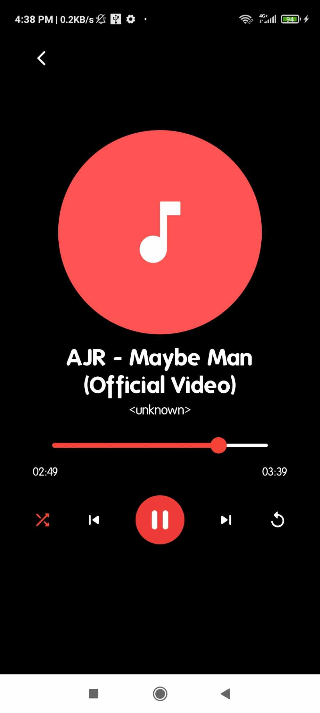

# Audio Player App

## Description

This is a Audio player application built using Flutter. The app allows users to scan their device for audio files, list them, and play them with various controls like play, pause, next, previous, shuffle, and repeat. The app also features a search functionality to filter songs and a loading skeleton while the app is fetching data. Notifications are used to keep the user informed about the currently playing song.

## Features

- **Scan Device for Audio Files**: The app scans the device for audio files and lists them.
- **Audio Playback**: Users can play, pause, skip to the next song, or go back to the previous song.
- **Shuffle and Repeat**: Users can shuffle the playlist or repeat the current song.
- **Search**: Users can search for songs by title or artist.
- **Loading Skeleton**: A skeleton loading screen is shown while the app is fetching data.
- **Notifications**: Notifications are used to show the currently playing song.
- **Artwork Display**: Displays artwork of the song if available.

## Dependencies

- `flutter`
- `on_audio_query`: To query audio files from the device.
- `permission_handler`: To handle permissions.
- `skeletonizer`: To show loading skeleton.
- `audioplayers`: For audio playback.
- `flutter_local_notifications`: To show notifications.
- `uri_to_file`: To convert URI to File.

## Project Structure

### HomePage

`HomePage` is the main screen of the application. It includes:

- **Requesting Permissions**: Requests necessary permissions to access audio files.
- **Scanning and Listing Files**: Scans the device for audio files and lists them.
- **Search Functionality**: Allows users to search for songs by title or artist.
- **Loading Skeleton**: Shows a loading skeleton while fetching data.
- **AudioBox Widget**: Displays each song in the list.

### AudioPage

`AudioPage` is the screen where the selected song is played. It includes:

- **Audio Playback Controls**: Play, pause, next, previous, shuffle, and repeat.
- **Displaying Song Info**: Displays the title, artist, and artwork of the current song.
- **Seek Bar**: Shows the progress of the current song and allows seeking.
- **Notifications**: Shows a notification for the currently playing song.

## Screenshots

Here are some screenshots of the app:

|  |  |  |
| :---------------------------------------: | :---------------------------------------: | :---------------------------------------: |

## Future Enhancements

- Add support for playlists.
- Improve error handling and user feedback.
- Add more customization options for notifications.
- Enhance UI and UX for better user interaction.
